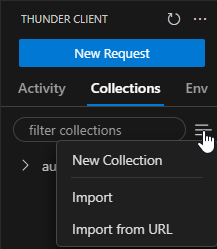

# Express Session Based Authentication Boilerplate

This project is a boilerplate for session based authentication in express and MongoDB. It serves as a starting point for hackathons and projects that require authentication. It provides the code as well as the basic template to get started with developing directly in VSCode.

## Profile

`WevDev.code-profile` has all the required extensions and settings to start your project in VScode

- Go to Gear Icon (Bottom Left) -> Profiles -> Import Profile -> Select File
- Locate the file that is present in the project directory names `Web Dev.code-profile`.
- This will setup Thunder Client and Prettier as the formatter of choice and enable format on save

## Load the thunder client collection

- Go to Thunder Client Extension from the sidebar
- Go to collections and click on the menu button present beside the search bar  
  
- Click on Import and locate the file. The file is present in the .vscode/thunder-collection_auth-boilerplate.json

## Configure the environment

You must create a .env file with the following variables in order for the express app to work:
PORT: The port to use. Thunder Client id configured to send requests to 5000  

```
NODE_ENV: set to "production" during production. Otherwise set to "development"
DATABASE_URI: The mongodb databse uri
SESSION_NAME: The string which specifies the name of the collection used for storing sessions  
SESSION_SECRET: A hash value set as a secret  
SESSION_LIFETIME: A string specifying the value in milliseconds of the lifetime of the session  
HTTPS_ENABLED: If you want to use https for testing set it to "true"  
KEY_FILE: Used if HTTPS_ENABLED is "true"  
CERT_FILE: Used if HTTPS_ENABLED is "true"
```

An example of the env file is provided in [example-env](example-env)

## Install the dependencies

Run `npm install` in the command line

## Run the server

Run the server in the terminal `npm run dev`. This will start a nodemon server on port 5000 by default
